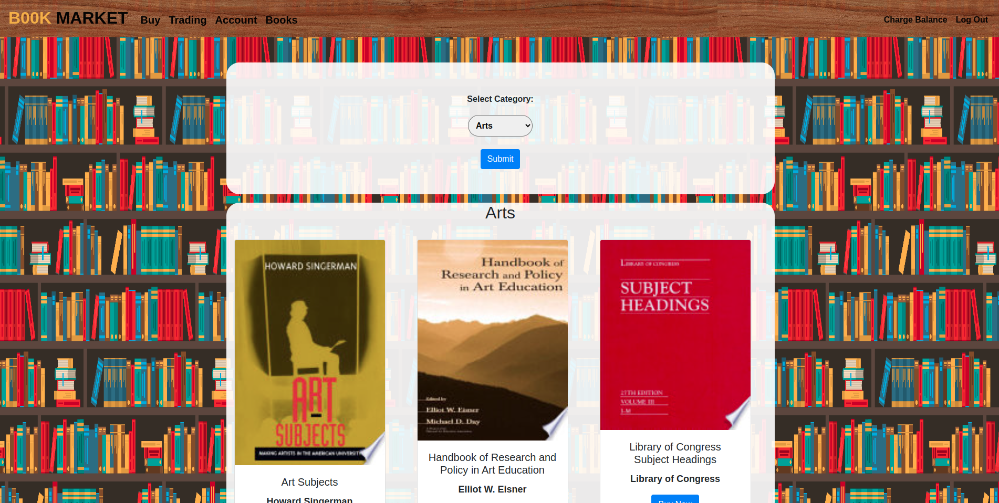
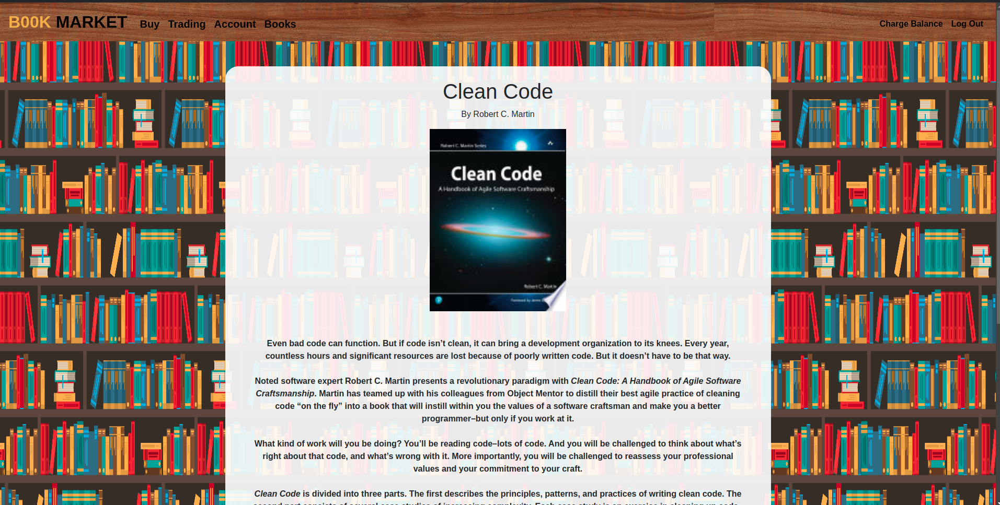
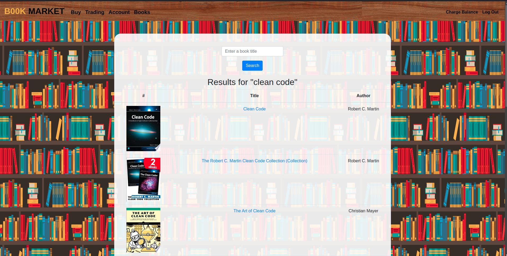

# Book Market

Book Market is a web application that allows users to buy, sell, and trade books. Users can browse books by category, purchase books, and manage their account. The application integrates with the Google Books API to fetch book details and provides a seamless experience for book enthusiasts.

## Features

- **User Authentication**: Users can register, log in, and manage their accounts.
- **Book Browsing**: Browse books by categories such as Arts, History, Science, Business, and Biography.
- **Book Purchase**: Users can purchase books and view their purchase history.
- **Sell Books**: Users can list books for sale.
- **Account Management**: Users can view their balance, update their address, and change their password.
- **Admin Features**: Admins can add new books to the platform.

## Technologies Used

- **Backend**: Flask (Python)
- **Frontend**: HTML, CSS, Bootstrap
- **Database**: SQLite
- **API**: Google Books API
- **Other Libraries**: Flask-Session, dotenv, requests

## Installation

1. **Clone the repository**:

   ```bash
   git clone https://github.com/Mazen-Ghanaym/CS50x-Final-Project
   cd CS50x-Final-Project
   ```

2. **Set up a virtual environment** (optional but recommended):

   ```bash
   python -m venv venv
   source venv/bin/activate  # On Windows use `venv\Scripts\activate`
   ```

3. **Install dependencies**:

   ```bash
   pip install -r requirements.txt
   ```

4. **Set up environment variables**:
   - Create a `.env` file in the root directory.
   - Add your Google Books API key:

     ```env
     API_KEY=your_google_books_api_key
     ```

5. **Initialize the database**:
   - Run the following command to create the SQLite database and tables:

     ```bash
     python init_db.py
     ```

6. **Run the application**:

   ```bash
   python app.py
   ```

7. **Access the application**:
   - Open your browser and go to `http://localhost:5000`.

## Usage

- **Register**: Create a new account by providing a username and password.
- **Login**: Log in with your credentials to access the platform.
- **Browse Books**: Use the navigation bar to browse books by category.
- **Purchase Books**: Select a book, enter the amount, and complete the purchase.
- **Sell Books**: List your books for sale by providing the book details.
- **Manage Account**: View your balance, update your address, and change your password.

## Screenshots





## Contributing

Contributions are welcome! Please follow these steps:

1. Fork the repository.
2. Create a new branch (`git checkout -b feature-branch`).
3. Make changes and commit them (`git commit -am 'Add new feature'`).
4. Push the changes to the branch (`git push origin feature-branch`).
5. Create a pull request.

## Acknowledgments

- [Google Books API](https://developers.google.com/books) for providing book data.
- [Flask](https://flask.palletsprojects.com/) for the web framework.
- [Bootstrap](https://getbootstrap.com/) for the frontend design.
